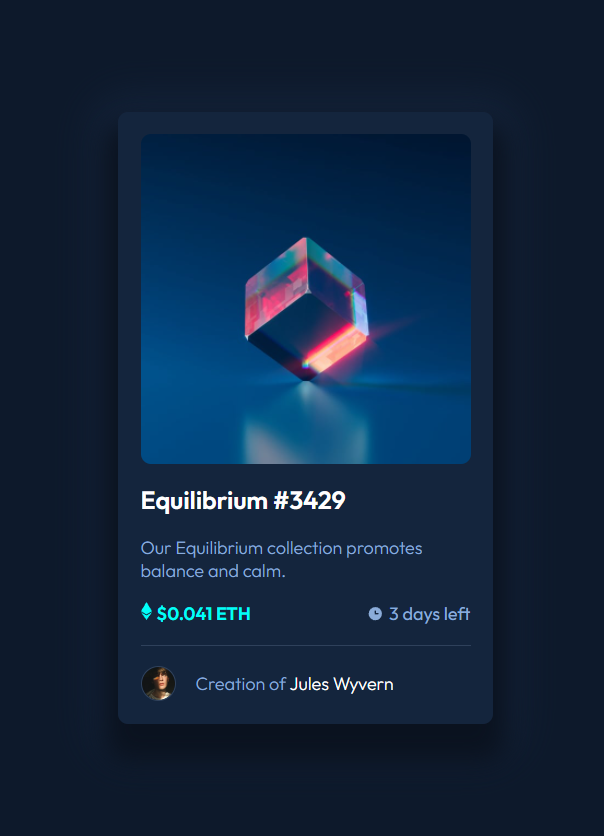
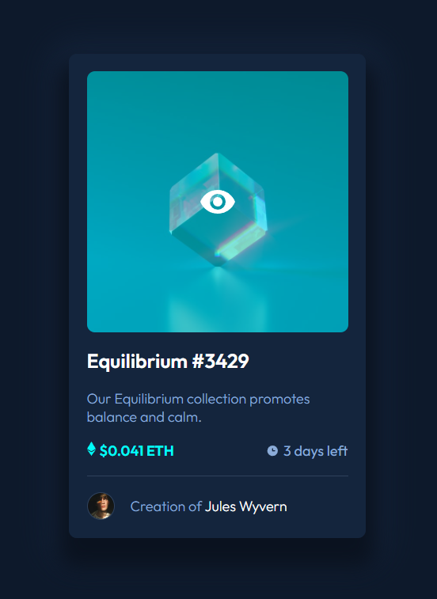
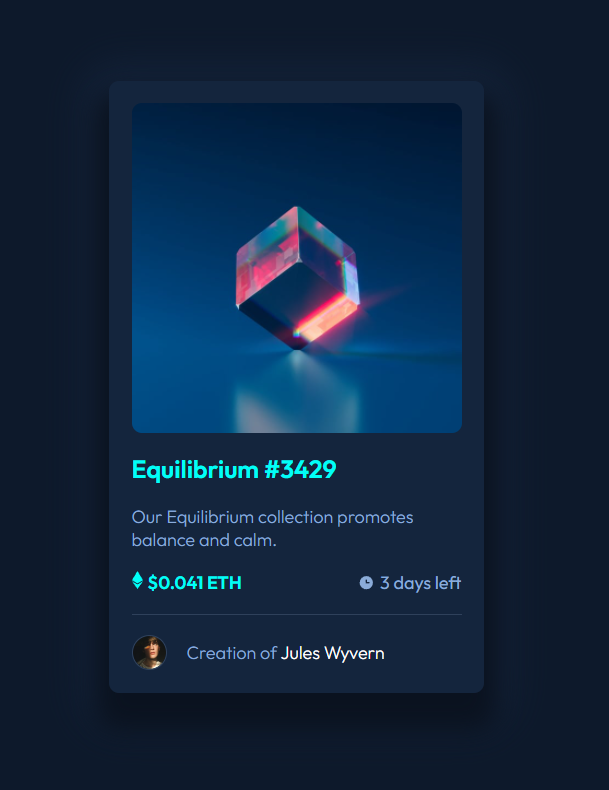
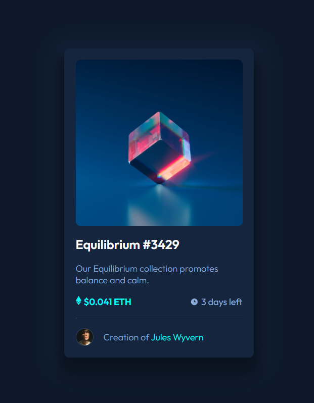

# Frontend Mentor - NFT preview card component solution

This is a solution to the [NFT preview card component challenge on Frontend Mentor](https://www.frontendmentor.io/challenges/nft-preview-card-component-SbdUL_w0U). Frontend Mentor challenges help you improve your coding skills by building realistic projects.

## Table of contents

- [Overview](#overview)
    - [The challenge](#the-challenge)
    - [Screenshot](#screenshot)
    - [Links](#links)
- [My process](#my-process)
    - [Built with](#built-with)
- [Author](#author)

**Note: Delete this note and update the table of contents based on what sections you keep.**

## Overview

### The challenge

Users should be able to:

- View the optimal layout depending on their device's screen size
- See hover states for interactive elements

### Screenshot

### Links

- Solution URL: [Heroku - NFT Card Preview Component](https://arcane-peak-26000.herokuapp.com/)

## My process

### Built with

- HTML5
- SASS
- CSS Custom Properties
- CSS Flexbox
- [React](https://reactjs.org/) - JS library

## Author

- Frontend Mentor - [@RogFed](https://www.frontendmentor.io/profile/RogFed)
- GitLab - [@rogfed](https://gitlab.com/rogfed)
